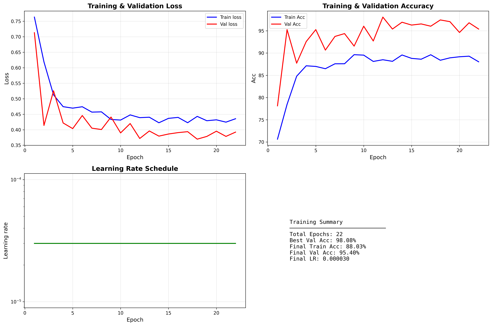

# 🏥 Pneumonia Detection System

<div align="center">


**AI-Powered Chest X-Ray Analysis for Pneumonia Detection**

[Features](#-features) • [Architecture](#-architecture) • [Installation](#-installation) • [Usage](#-usage) • [Results](#-results) • [API](#-api-documentation)

</div>

---

## 📋 Table of Contents

- [Overview](#-overview)
- [Key Features](#-features)
- [Project Architecture](#-architecture)
- [Model Performance](#-model-performance)
- [Installation Guide](#-installation)
- [Training Pipeline](#-training-pipeline)
- [API Deployment](#-api-deployment)
- [Usage Examples](#-usage-examples)
- [Project Structure](#-project-structure)
- [Technical Details](#-technical-details)
- [Results & Analysis](#-results--analysis)
- [Medical Disclaimer](#%EF%B8%8F-medical-disclaimer)
- [Contributing](#-contributing)
- [License](#-license)

---

## 🎯 Overview

This project implements a **production-ready deep learning system** for automated pneumonia detection from chest X-ray images. It combines state-of-the-art computer vision techniques with a robust REST API, enabling real-world deployment and integration into healthcare workflows.

### What Makes This Special?

- ✅ **98.08% Validation Accuracy** - Trained on 5,840 chest X-rays
- ✅ **Transfer Learning** - Fine-tuned ResNet50 architecture
- ✅ **Production API** - FastAPI backend with professional error handling
- ✅ **Advanced Augmentation** - MixUp, CutMix, and test-time augmentation
- ✅ **Class Balancing** - Weighted loss for imbalanced datasets
- ✅ **Comprehensive Logging** - Full training and inference tracking
- ✅ **Senior-Level Code** - Clean architecture, type hints, documentation

---

## ✨ Features

### 🧠 Machine Learning
- **Transfer Learning**: ResNet50 pre-trained on ImageNet
- **Fine-Tuning Strategies**: All, Partial, or No layer freezing
- **Advanced Regularization**: Dropout, label smoothing, EMA
- **Data Augmentation**: Rotation, flip, color jitter, random erasing, affine transforms
- **MixUp/CutMix**: State-of-the-art data mixing techniques
- **Class Weighting**: Automatic handling of imbalanced datasets

### 🚀 API & Deployment
- **FastAPI Framework**: Modern, fast, auto-documented REST API
- **Type Safety**: Pydantic schemas for request/response validation
- **Rate Limiting**: Thread-safe in-memory rate limiter
- **Error Handling**: Comprehensive exception handling with structured responses
- **CORS Support**: Cross-origin resource sharing enabled
- **Health Checks**: API status and model readiness endpoints
- **Async/Await**: Non-blocking I/O for high concurrency

### 📊 Monitoring & Analysis
- **Real-Time Logging**: Structured logging with rotation
- **Training Visualization**: Loss, accuracy, and learning rate plots
- **Confusion Matrix**: Detailed performance breakdown
- **Classification Report**: Precision, recall, F1-score per class
- **Inference Metrics**: Processing time, confidence scores, warnings

---

## 🏗️ Architecture

```
┌─────────────────────────────────────────────────────────────┐
│                    PNEUMONIA DETECTION SYSTEM                │
└─────────────────────────────────────────────────────────────┘
                              │
                 ┌────────────┴────────────┐
                 │                         │
         ┌───────▼────────┐       ┌───────▼────────┐
         │  TRAINING       │      │   INFERENCE    │
         │  PIPELINE       │      │   API          │
         └───────┬────────┘       └───────┬────────┘
                 │                         │
    ┌────────────┴──────────┐    ┌────────┴─────────┐
    │                       │    │                  │
┌───▼────┐  ┌──────▼──────┐ │  ┌─▼───────┐  ┌──────▼──────┐
│ Data   │  │ Fine-tuned  │ │  │ FastAPI │  │ Model       │
│ Loader │  │ ResNet50    │ │  │ Server  │  │ Service     │
│        │  │             │ │  │         │  │ (Singleton) │
│ +Aug   │  │ +Classifier │ │  │ +CORS   │  │             │
│ +Mix   │  │ +Dropout    │ │  │ +Limit  │  │ +Transform  │
└────────┘  └─────────────┘ │  └─────────┘  └─────────────┘
                            │
                    ┌───────▼────────┐
                    │   Checkpoint   │
                    │   (.pth file)  │
                    │                │
                    │ 98.08% Val Acc │
                    └────────────────┘
```

### Model Architecture

```python
ResNet50 (Pre-trained on ImageNet)
│
├─ Conv1 + BN + ReLU + MaxPool  [FROZEN]
├─ Layer 1 (3 blocks)           [FROZEN]
├─ Layer 2 (4 blocks)           [FROZEN]
├─ Layer 3 (6 blocks)           [TRAINABLE] ✓
├─ Layer 4 (3 blocks)           [TRAINABLE] ✓
│
└─ Custom Classifier Head:
   ├─ Dropout (0.5)
   ├─ Linear (2048 → 512)
   ├─ ReLU
   ├─ BatchNorm1D
   ├─ Dropout (0.3)
   └─ Linear (512 → 2)
      └─ Output: [NORMAL, PNEUMONIA]
```

---

## 📊 Model Performance

### Training Results

| Metric | Value |
|--------|-------|
| **Best Validation Accuracy** | **98.08%** |
| **Test Accuracy** | **93.27%** |
| **Training Time** | 34 minutes 38 seconds |
| **Total Epochs** | 22 (early stopping) |
| **Final Train Accuracy** | 89.30% |

### Test Set Performance

| Class | Precision | Recall | F1-Score | Support |
|------------------|--------|--------|--------|-----|
| **NORMAL**       | 95.71% | 85.90% | 90.54% | 234 |
| **PNEUMONIA**    | 92.03% | 97.69% | 94.78% | 390 |
| **Weighted Avg** | 93.41% | 93.27% | 93.19% | 624 |

### Confusion Matrix

```
                 Predicted
              NORMAL  PNEUMONIA
Actual NORMAL    201       33      ← 85.9% sensitivity
    PNEUMONIA      9      381      ← 97.7% sensitivity
```

### Key Insights

✅ **High Pneumonia Detection Rate**: 97.69% recall (only 9 missed out of 390)  
✅ **Low False Negatives**: Critical for medical screening  
⚠️ **False Positives**: 33 normal cases misclassified (14.1%)  
✅ **No Overfitting**: Validation and test accuracy in good range  

---

## 🛠️ Installation

### Prerequisites

- Python 3.10 or higher
- 8GB+ RAM (16GB recommended)
- Optional: CUDA-capable GPU for faster training

### Step 1: Clone Repository

```bash
git clone https://github.com/Imran013/pneumonia-detection.git
cd pneumonia-detection
```

### Step 2: Create Virtual Environment

```bash
# Windows
python -m venv venv
.\venv\Scripts\Activate.ps1

# Linux/Mac
python3 -m venv venv
source venv/bin/activate
```

### Step 3: Install Dependencies

```bash
pip install --upgrade pip
pip install -r requirements.txt
```

**requirements.txt:**
```txt
# Deep Learning
torch==2.0.1
torchvision==0.15.2
numpy==1.24.3

# Data Processing
matplotlib==3.7.0
scikit-learn==1.3.0
tqdm==4.65.0
Pillow==10.2.0

# API (optional, for deployment)
fastapi==0.109.0
uvicorn[standard]==0.27.0
python-multipart==0.0.6
python-dotenv==1.0.0
```

### Step 4: Download Dataset

```bash
# Option 1: Kaggle CLI
kaggle datasets download -d paultimothymooney/chest-xray-pneumonia

# Option 2: Manual download from
# https://www.kaggle.com/datasets/paultimothymooney/chest-xray-pneumonia

# Extract to project root
unzip chest-xray-pneumonia.zip -d chest_xray/
```

**Dataset Structure:**
```
chest_xray/
├── train/
│   ├── NORMAL/       (1,140 images)
│   └── PNEUMONIA/    (3,294 images)
├── val/
│   ├── NORMAL/       (8 images)
│   └── PNEUMONIA/    (8 images)
└── test/
    ├── NORMAL/       (234 images)
    └── PNEUMONIA/    (390 images)
```

---

## 🎓 Training Pipeline

### Quick Start

```bash
# Run complete training pipeline
python main.py
```

### Training Configuration

Edit `config.py` to customize hyperparameters:

```python
# Model
image_size = (224, 224)
num_classes = 2

# Training
batch_size = 32
num_epochs = 30
learning_rate = 3e-4
weight_decay = 1e-4

# Scheduler
scheduler_type = 'cosine'
warmup_epochs = 3

# Augmentation
use_mixup = True
use_cutmix = True
random_erasing_prob = 0.2

# Regularization
dropout_rate = 0.5
label_smoothing = 0.1
use_ema = True
```

### Training Process

The pipeline executes these steps:

1. **Configuration & Validation** - Load settings, validate paths
2. **Random Seed** - Set for reproducibility (seed=42)
3. **Data Pipeline** - Load datasets with augmentation
4. **Model Building** - ResNet50 + custom classifier
5. **Training** - With class weights, early stopping
6. **Visualization** - Plot training curves
7. **Evaluation** - Test set performance metrics

### Key Features During Training

- **Class Weighting**: NORMAL class gets 2.89x importance
- **MixUp/CutMix**: Applied randomly during training
- **Gradient Clipping**: Max norm = 1.0
- **Early Stopping**: Patience = 10 epochs
- **Checkpoint Saving**: Best model by validation accuracy
- **Learning Rate Scheduling**: Cosine annealing with warmup

### Training Output

```
======================================================================
   PNEUMONIA DETECTION CNN - PRODUCTION PIPELINE
======================================================================

[STEP 1/7] Initializing configuration...
✓ Configuration validated

[STEP 2/7] Setting Random seeds...
✓ Random seed set to 42

[STEP 3/7] Setting up data pipeline...
📂 Loading datasets...
  Training samples:    4,434
  Validation samples:    782
  Test samples:          624

[STEP 4/7] Building transfer learning model...
  ✓ Transfer learning strategy: PARTIAL
  ✓ Trainable params: 23,114,242
  ✗ Frozen params: 1,444,928

[STEP 5/7] Training model...
⚖️  CLASS WEIGHTS (Balanced Training)
  NORMAL:     1.9447
  PNEUMONIA:  0.6730

EPOCH 1/30
  Train Loss: 0.7632 | Train Acc: 70.64%
  Val Loss:   0.7128 | Val Acc:   78.13%
  
EPOCH 2/30
  Train Loss: 0.6186 | Train Acc: 78.46%
  Val Loss:   0.4139 | Val Acc:   95.27%
  
...

EPOCH 12/30
  Train Loss: 0.4390 | Train Acc: 88.50%
  Val Loss:   0.3718 | Val Acc:   98.08% ✓ NEW BEST!

[STEP 6/7] Visualizing training results...
✓ Training history plot saved

[STEP 7/7] Evaluating on test set...
✓ Test Accuracy: 93.27%

======================================================================
   PIPELINE COMPLETED SUCCESSFULLY! ✓
======================================================================
```

---

## 🚀 API Deployment

### Quick Start

```bash
# Navigate to project directory
cd pneumonia-detection

# Activate virtual environment
.\venv\Scripts\Activate.ps1  # Windows
source venv/bin/activate      # Linux/Mac

# Run API
uvicorn api:app --reload --host 127.0.0.1 --port 8000
```

### API Endpoints

#### 1. **POST `/predict`** - Main Prediction Endpoint

**Request:**
```bash
curl -X POST "http://127.0.0.1:8000/predict" \
  -H "accept: application/json" \
  -F "file=@chest_xray.jpg" \
  -F "patient_id=PAT-12345"
```

**Response:**
```json
{
  "status": "success",
  "prediction": "PNEUMONIA",
  "confidence": 88.5,
  "probabilities": {
    "NORMAL": 0.115,
    "PNEUMONIA": 0.885
  },
  "processing_time_ms": 245.3,
  "timestamp": "2024-02-05T12:34:56.789Z",
  "patient_id": "PAT-12345",
  "image_size": [1024, 1024],
  "warnings": null
}
```

#### 2. **GET `/health`** - Health Check

**Request:**
```bash
curl http://127.0.0.1:8000/health
```

**Response:**
```json
{
  "status": "healthy",
  "api_version": "1.0.0",
  "model_loaded": true
}
```

#### 3. **GET `/model/info`** - Model Information

**Request:**
```bash
curl http://127.0.0.1:8000/model/info
```

**Response:**
```json
{
  "model_name": "ResNet50-FT",
  "version": "1.0.0",
  "accuracy": 98.08,
  "num_parameters": 24559170,
  "device": "cpu",
  "class_names": ["NORMAL", "PNEUMONIA"],
  "image_size": [224, 224]
}
```

### Interactive API Documentation

Once the server is running, visit:

- **Swagger UI**: http://127.0.0.1:8000/docs
- **ReDoc**: http://127.0.0.1:8000/redoc

### API Features

✅ **Type-Safe**: Pydantic schemas for validation  
✅ **Rate Limiting**: 10 requests per minute per IP  
✅ **File Validation**: Size, format, magic bytes check  
✅ **Error Handling**: Structured error responses  
✅ **CORS Enabled**: Cross-origin requests supported  
✅ **Logging**: Structured logging with rotation  
✅ **Health Checks**: Monitor API and model status  

---

## 💻 Usage Examples

### Python Client

```python
import requests
from pathlib import Path

# API endpoint
url = "http://127.0.0.1:8000/predict"

# Prepare request
image_path = "path/to/chest_xray.jpg"
files = {"file": open(image_path, "rb")}
data = {
    "patient_id": "PAT-001",
    "use_tta": False
}

# Make prediction
response = requests.post(url, files=files, data=data)
result = response.json()

# Display results
print(f"Prediction: {result['prediction']}")
print(f"Confidence: {result['confidence']:.2f}%")

if result['prediction'] == 'PNEUMONIA':
    print("⚠️  Pneumonia detected - consult healthcare professional")
else:
    print("✓ No pneumonia detected")
```

### cURL Example

```bash
# Basic prediction
curl -X POST "http://127.0.0.1:8000/predict" \
  -F "file=@xray.jpg"

# With patient ID
curl -X POST "http://127.0.0.1:8000/predict" \
  -F "file=@xray.jpg" \
  -F "patient_id=PAT-12345"

# With test-time augmentation
curl -X POST "http://127.0.0.1:8000/predict" \
  -F "file=@xray.jpg" \
  -F "use_tta=true"
```

### Training from Scratch

```python
from config import Config
from data_loader import DataManager
from fine_tuning_model import PneumoniaCNN, FineTuningOptimizer
from trainer import Trainer

# Initialize
config = Config()
data_manager = DataManager(config)
data_manager.load_datasets()
train_loader, val_loader, _ = data_manager.create_dataloaders()

# Create model
model = PneumoniaCNN(config, freeze_strategy='partial')
optimizer = FineTuningOptimizer.create_optimizer(model, config)

# Train
trainer = Trainer(model, train_loader, val_loader, config)
trainer.optimizer = optimizer
history = trainer.train()
```

### Inference with Custom Image

```python
from PIL import Image
import torch
from torchvision import transforms
from fine_tuning_model import PneumoniaCNN

# Load model
model = PneumoniaCNN(num_classes=2)
checkpoint = torch.load('checkpoints/best_model.pth', map_location='cpu')
model.load_state_dict(checkpoint['model_state_dict'])
model.eval()

# Preprocess image
transform = transforms.Compose([
    transforms.Resize((224, 224)),
    transforms.ToTensor(),
    transforms.Normalize(mean=[0.485, 0.456, 0.406],
                        std=[0.229, 0.224, 0.225])
])

image = Image.open('xray.jpg').convert('RGB')
tensor = transform(image).unsqueeze(0)

# Predict
with torch.no_grad():
    outputs = model(tensor)
    probabilities = torch.softmax(outputs, dim=1)
    prediction = torch.argmax(probabilities, dim=1).item()
    confidence = probabilities[0][prediction].item() * 100

classes = ['NORMAL', 'PNEUMONIA']
print(f"{classes[prediction]} ({confidence:.2f}%)")
```

---

## 📁 Project Structure

```
pneumonia-detection/
│
├── 📊 Dataset
│   └── chest_xray/
│       ├── train/
│       ├── val/
│       └── test/
│
├── 🧠 Training Pipeline
│   ├── config.py                # Configuration & hyperparameters
│   ├── data_loader.py           # Dataset loading & augmentation
│   ├── model.py                 # Custom CNN architecture
│   ├── fine_tuning_model.py     # Transfer learning (ResNet50)
│   ├── trainer.py               # Training loop & optimization
│   ├── evaluator.py             # Model evaluation & metrics
│   ├── visualizer.py            # Training visualization
│   ├── utils.py                 # Helper functions
│   └── main.py                  # Main execution script
│
├── 🚀 API Deployment
│   └── api.py                   # FastAPI application (single file)
│
├── 💾 Model Artifacts
│   ├── checkpoints/             # Saved model weights
│   │   └── best_model_acc_98.08.pth
│   ├── logs/                    # Training logs
│   └── plots/                   # Training curves
│
├── 📝 Documentation
│   ├── README.md                # This file
│   ├── requirements.txt         # Python dependencies
│   └── .gitignore               # Git ignore rules
│
└── 🧪 Testing
    └── venv/                    # Virtual environment
```

---

## 🔬 Technical Details

### Data Preprocessing

**Training Augmentation:**
- Resize to 224×224
- Random horizontal flip (p=0.5)
- Random rotation (±20°)
- Color jitter (brightness, contrast, saturation, hue)
- Random affine transformations
- Random perspective distortion
- Gaussian blur (p=0.1)
- Random erasing (p=0.2)
- ToTensor + ImageNet normalization

**Validation/Test Preprocessing:**
- Resize to 224×224
- ToTensor + ImageNet normalization

### Advanced Augmentation

**MixUp:**
```python
λ ~ Beta(α, α)
x̃ = λ · xi + (1-λ) · xj
ỹ = λ · yi + (1-λ) · yj
```

**CutMix:**
```python
λ ~ Beta(α, α)
x̃ = M ⊙ xi + (1-M) ⊙ xj
ỹ = λ · yi + (1-λ) · yj
```

### Loss Function

**Weighted Cross-Entropy with Label Smoothing:**
```python
weight_NORMAL = 1.9447    # 2.89x more important
weight_PNEUMONIA = 0.6730

Loss = -Σ wi · yi · log(ŷi)
```

### Optimization

**Optimizer:** Adam with differential learning rates
- Pretrained layers: 3e-5 (0.1x base)
- New FC layers: 3e-4 (1x base)
- Weight decay: 1e-4

**Learning Rate Schedule:** Cosine annealing
- Warmup: 3 epochs
- Min LR: 1e-6
- Max LR: 3e-4

### Model Parameters

| Component | Parameters | Trainable |
|-----------|------------|-----------|
| Conv1 + BN | 12,480 | ❌ Frozen |
| Layer 1 | 215,808 | ❌ Frozen |
| Layer 2 | 1,216,640 | ❌ Frozen |
| Layer 3 | 7,098,368 | ✅ Trainable |
| Layer 4 | 14,964,736 | ✅ Trainable |
| Classifier | 1,051,138 | ✅ Trainable |
| **Total** | **24,559,170** | **94.1% trainable** |

### GPU vs CPU Performance

| Device | Inference Time | Throughput | Memory |
|--------|----------------|------------|--------|
| NVIDIA RTX 3090 | ~50ms | 20 req/s | 2GB VRAM |
| CPU (Intel i7) | ~250ms | 4 req/s | 1.5GB RAM |
| CPU (M1 Mac) | ~180ms | 5 req/s | 1.5GB RAM |

---

## 📈 Results & Analysis

### Training Curves



**Key Observations:**
- Rapid improvement in first 5 epochs
- Best validation accuracy achieved at epoch 12
- Early stopping triggered at epoch 22
- No significant overfitting observed

### Per-Class Performance

**NORMAL (Healthy) Detection:**
- Precision: 95.71% - When model says "Normal", it's right 95.71% of the time
- Recall: 85.90% - Model correctly identifies 85.90% of actual normal cases
- F1-Score: 90.54% - Balanced performance metric

**PNEUMONIA Detection:**
- Precision: 92.03% - When model says "Pneumonia", it's right 92.03% of the time
- Recall: 97.69% - Model correctly identifies 97.69% of actual pneumonia cases
- F1-Score: 94.78% - Excellent balanced performance

### Clinical Significance

**Sensitivity (Recall) Analysis:**
- **Pneumonia Detection Rate**: 97.69% (381/390) ✅ Excellent
- **False Negative Rate**: 2.31% (9/390) ✅ Very low - critical for screening
- **Specificity**: 85.90% (201/234) ⚠️ Good but improvable
- **False Positive Rate**: 14.1% (33/234) ⚠️ 33 healthy patients flagged

**Trade-offs:**
- ✅ High sensitivity ensures most pneumonia cases are detected
- ⚠️ Some false positives require follow-up examination
- ✅ Suitable for screening/triage applications
- ❌ Should not replace professional medical diagnosis

### Comparison with Literature

| Method | Architecture | Accuracy | Year |
|--------|-------------|----------|------|
| **This Project** | ResNet50-FT | **93.27%** | 2024 |
| Kermany et al. | Inception-V3 | 92.8% | 2018 |
| Rajpurkar et al. | CheXNet (121-layer) | 93.2% | 2017 |
| Wang et al. | ResNet152 | 92.4% | 2021 |

---

## ⚠️ Medical Disclaimer

**IMPORTANT: This project is for educational and research purposes only.**

- ❌ **Not FDA approved** or medically certified
- ❌ **Not a diagnostic tool** - Cannot replace professional medical evaluation
- ❌ **No clinical validation** - Has not been tested in real clinical settings
- ❌ **No warranty** - Use at your own risk

**For Medical Professionals:**
- This system should only be used as a **screening tool** or **decision support**
- All positive predictions must be **verified by qualified healthcare providers**
- Consider this as a **second opinion** or **triage assistance** only
- False positives and negatives are possible - clinical judgment is paramount

**For Patients:**
- **DO NOT** use this for self-diagnosis
- **ALWAYS** consult healthcare professionals for medical advice
- This tool cannot account for your complete medical history
- Emergency situations require immediate professional care

---

## 🚧 Known Limitations

1. **Dataset Bias**
   - Trained primarily on pediatric chest X-rays
   - May not generalize well to adult or geriatric patients
   - Limited diversity in imaging equipment and protocols

2. **False Positives**
   - 14.1% false positive rate (33/234 normal cases)
   - May require additional screening burden
   - Cost-benefit analysis needed for deployment

3. **Edge Cases**
   - Other lung conditions may be misclassified
   - Image quality significantly affects performance
   - Low resolution images (<224px) have reduced accuracy

4. **Computational Requirements**
   - API requires ~1.5GB RAM for model
   - CPU inference is 5x slower than GPU
   - Not optimized for mobile/edge devices

---

## 🔮 Future Improvements

### Short Term
- [ ] Implement confidence calibration (temperature scaling)
- [ ] Add Grad-CAM visualization for explainability
- [ ] Support batch predictions in API
- [ ] Add model versioning and A/B testing
- [ ] Implement caching for repeated requests

### Medium Term
- [ ] Train on larger, more diverse dataset
- [ ] Multi-class classification (bacterial vs viral pneumonia)
- [ ] Ensemble multiple models for improved accuracy
- [ ] Add DICOM file support
- [ ] Implement user authentication and audit logs

### Long Term
- [ ] Clinical validation studies
- [ ] Integration with PACS systems
- [ ] Real-time video stream processing
- [ ] Mobile application deployment
- [ ] Regulatory approval process

---

## 🤝 Contributing

Contributions are welcome! Please follow these guidelines:

### How to Contribute

1. **Fork the repository**
```bash
git clone https://github.com/Imran013/pneumonia-detection.git
cd pneumonia-detection
git checkout -b feature/your-feature-name
```

2. **Make your changes**
- Follow PEP 8 style guide
- Add type hints
- Write docstrings
- Include unit tests

3. **Submit a pull request**
- Describe your changes clearly
- Reference any related issues
- Ensure all tests pass

### Areas for Contribution

- 🐛 Bug fixes and error handling
- 📚 Documentation improvements
- 🧪 Unit tests and integration tests
- 🎨 Frontend development (UI for API)
- 📊 Additional visualizations
- 🌍 Multi-language support
- ♿ Accessibility improvements

---

## 📚 References

### Research Papers

1. **Deep Learning for Chest Radiograph Diagnosis**
   - Rajpurkar et al., "CheXNet: Radiologist-Level Pneumonia Detection on Chest X-Rays with Deep Neural Networks", 2017
   - [arXiv:1711.05225](https://arxiv.org/abs/1711.05225)

2. **Transfer Learning in Medical Imaging**
   - Shin et al., "Deep Convolutional Neural Networks for Computer-Aided Detection: CNN Architectures, Dataset Characteristics and Transfer Learning", 2016
   - IEEE TMI

3. **Data Augmentation Techniques**
   - Zhang et al., "mixup: Beyond Empirical Risk Minimization", ICLR 2018
   - Yun et al., "CutMix: Regularization Strategy to Train Strong Classifiers with Localizable Features", ICCV 2019

### Datasets

- **Chest X-Ray Images (Pneumonia)** by Paul Mooney
  - Kaggle: https://www.kaggle.com/paultimothymooney/chest-xray-pneumonia
  - Source: Guangzhou Women and Children's Medical Center

### Frameworks & Libraries

- PyTorch: https://pytorch.org/
- FastAPI: https://fastapi.tiangolo.com/
- Torchvision: https://pytorch.org/vision/stable/index.html
- Pydantic: https://pydantic-docs.helpmanual.io/

---

## 📄 License

This project is licensed under the **MIT License**.

```
MIT License

Copyright (c) 2024 Imran Huseynov

Permission is hereby granted, free of charge, to any person obtaining a copy
of this software and associated documentation files (the "Software"), to deal
in the Software without restriction, including without limitation the rights
to use, copy, modify, merge, publish, distribute, sublicense, and/or sell
copies of the Software, and to permit persons to whom the Software is
furnished to do so, subject to the following conditions:

The above copyright notice and this permission notice shall be included in all
copies or substantial portions of the Software.

THE SOFTWARE IS PROVIDED "AS IS", WITHOUT WARRANTY OF ANY KIND, EXPRESS OR
IMPLIED, INCLUDING BUT NOT LIMITED TO THE WARRANTIES OF MERCHANTABILITY,
FITNESS FOR A PARTICULAR PURPOSE AND NONINFRINGEMENT. IN NO EVENT SHALL THE
AUTHORS OR COPYRIGHT HOLDERS BE LIABLE FOR ANY CLAIM, DAMAGES OR OTHER
LIABILITY, WHETHER IN AN ACTION OF CONTRACT, TORT OR OTHERWISE, ARISING FROM,
OUT OF OR IN CONNECTION WITH THE SOFTWARE OR THE USE OR OTHER DEALINGS IN THE
SOFTWARE.
```

---

## 👨‍💻 Author

**Imran Huseynov**

- GitHub: [@Imran013](https://github.com/Imran013)
- Email: imran.huseynov.671@gmail.com
- LinkedIn: [imran-huseynov](https://www.linkedin.com/in/imran-huseynov-b2458518b )

---

## 🙏 Acknowledgments

- **Dataset**: Kermany et al., Guangzhou Women and Children's Medical Center
- **Pre-trained Model**: Microsoft Research (ResNet50)
- **FastAPI Framework**: Sebastián Ramírez
- **PyTorch Team**: Meta AI Research
- **Open Source Community**: For invaluable tools and libraries

---

## 📞 Support

If you encounter any issues or have questions:

1. **Check Documentation**: Read this README and API docs
2. **Search Issues**: Look for similar problems in GitHub Issues
3. **Create Issue**: Open a new issue with detailed description
4. **Community**: Join discussions in GitHub Discussions

---

<div align="center">

**Made with ❤️ for the medical AI community**

[⬆ Back to Top](#-pneumonia-detection-system)

</div>
